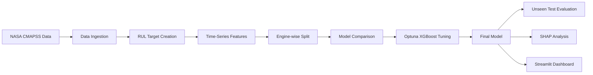

# Predictive Maintenance — Remaining Useful Life Prediction

An end-to-end machine learning project for predicting the **Remaining Useful Life (RUL)** of turbofan engines using NASA CMAPSS sensor data.

The project covers the complete workflow: data ingestion, time-series feature engineering, engine-wise validation, model comparison, XGBoost tuning, model interpretation, unseen-test evaluation, and an interactive Streamlit dashboard.

---

## Project Overview

Predictive maintenance aims to estimate how much useful operating life remains before equipment requires maintenance.

In this project, each engine is observed over multiple operating cycles. Sensor readings and operating conditions are used to estimate its remaining cycles before failure.

### Pipeline



---

## Results

The final model is an **optimized XGBoost regressor**.

### NASA unseen test set

| Metric | Result |
|---|---:|
| Engines evaluated | **707** |
| MAE | **18.79 cycles** |
| RMSE | **26.06 cycles** |
| R² | **0.740** |

Dataset-level performance:

| Dataset | MAE | RMSE | R² |
|---|---:|---:|---:|
| FD001 | 13.34 | 17.81 | 0.816 |
| FD002 | 19.52 | 27.27 | 0.743 |
| FD003 | 13.61 | 18.34 | 0.804 |
| FD004 | 22.31 | 29.93 | 0.699 |

The NASA test evaluation uses the **last observed cycle of each test engine**, matching the structure of the supplied NASA RUL labels.

> **Note:** The RUL cap of 125 cycles was selected after benchmark experimentation involving the public CMAPSS test labels. This is documented as a methodological limitation in `Engineering_Decision.md`. A stricter experiment would select the cap using training/validation data only and use the official test set once for the final evaluation.

---

## What I Built

### 1. Data pipeline

- Loads all four CMAPSS training datasets.
- Creates an engine identifier from dataset and unit IDs.
- Calculates training RUL from the maximum observed engine cycle.
- Keeps the data grouped by engine throughout temporal feature engineering.

### 2. Feature engineering

The final model uses:

- Current operating cycle
- One-cycle sensor lag features
- Three-cycle rolling sensor means
- Operating-condition information

Lag and rolling features are calculated within each engine so that information does not cross engine boundaries.

### 3. Model development

I compared:

- Linear Regression
- Random Forest
- XGBoost
- Optimized XGBoost

Optuna was used to search the main XGBoost hyperparameters.

### 4. Model interpretation

Two approaches are included:

- XGBoost feature importance
- SHAP feature importance

The analysis shows that `cycle` is the strongest feature, followed by several sensor measurements and their lagged versions.

### 5. Unseen-test evaluation

The final model is evaluated against the separate NASA test observations and RUL files.

The evaluation includes:

- MAE
- RMSE
- R²
- Actual vs predicted plots
- Residual analysis
- Dataset-level performance
- Worst prediction analysis

### 6. Interactive dashboard

The Streamlit dashboard provides:

- Fleet-level RUL overview
- Engine health distribution
- Engines requiring attention
- Individual engine exploration
- RUL trend visualization
- Dataset-level comparison
- Model performance information

The dashboard classifies predicted RUL into:

| Predicted RUL | Status |
|---|---|
| ≤ 30 cycles | Critical |
| 31–60 cycles | Warning |
| > 60 cycles | Healthy |

These are **decision-support thresholds for the dashboard**, not calibrated probabilities of failure.

---

## Why Engine-wise Splitting?

This is one of the most important parts of the project.

A random row-level split could place observations from the same engine into both training and validation sets. Since each engine produces many sequential observations, this could make the evaluation overly optimistic.

Instead, the project keeps all observations from an engine in the same split.

```text
Engine A ───────────────→ Train

Engine B ───────────────→ Train

Engine C ───────────────→ Validation

Engine D ───────────────→ Validation
```

This gives a more realistic estimate of performance on previously unseen engines.

---

## Why Keep `cycle`?

`cycle` is strongly related to engine age, so it was tested explicitly.

An ablation experiment showed that removing it reduced model performance. Since the current operating cycle is available when making a prediction, it was retained as an input feature.

It is treated as an **age-related feature**, not as a direct measurement of engine health.

---

## Project Structure

```text
predictive_maintenance_RUL/
│
├── configs/
│   └── config.yaml
│
├── dashboard/
│   └── app.py
│
├── data/
│   └── raw/                 # CMAPSS data (not tracked by Git)
│
├── models/                  # Generated model files (not tracked by Git)
│
├── notebooks/
│   └── nb.ipynb
│
├── reports/
│   ├── metrics/
│   ├── figures/
│   └── predictions/
│
├── src/
│   ├── data/
│   ├── features/
│   ├── inference/
│   ├── models/
│   ├── utils/
│   └── visualization/
│
├── tests/
│
├── .gitignore
├── Engineering_Decision.md
├── LICENSE
├── main.py
└── requirements.txt
```

---

## Setup

### 1. Clone the repository

```bash
git clone <your-repository-url>
cd predictive_maintenance_RUL
```

### 2. Create a virtual environment

Windows:

```powershell
python -m venv .venv
.venv\Scripts\Activate.ps1
```

macOS / Linux:

```bash
python3 -m venv .venv
source .venv/bin/activate
```

### 3. Install dependencies

```bash
pip install -r requirements.txt
```

### 4. Add the NASA CMAPSS data

Place the training, test and RUL files inside:

```text
data/raw/
```

Expected files:

```text
train_FD001.txt
train_FD002.txt
train_FD003.txt
train_FD004.txt

test_FD001.txt
test_FD002.txt
test_FD003.txt
test_FD004.txt

RUL_FD001.txt
RUL_FD002.txt
RUL_FD003.txt
RUL_FD004.txt
```

The raw dataset is intentionally excluded from Git.

---

## Run the Project

Run the complete machine learning pipeline from the project root:

```bash
python main.py
```

This runs the main training, evaluation and inference workflow and generates the required model and report artifacts.

### Run tests

```bash
pytest
```

### Launch the dashboard

```bash
streamlit run dashboard/app.py
```

---

## Configuration

Project settings are centralized in:

```text
configs/config.yaml
```

This includes:

- Project random seed
- Data/model/report paths
- Feature-engineering settings
- RUL cap
- Optuna trial count
- XGBoost parameters
- Dashboard risk thresholds

Keeping these values outside the implementation makes the pipeline easier to reproduce and modify.

---

## Key Engineering Decisions

A detailed explanation of the main modelling decisions is available in:

```text
Engineering_Decision.md
```

Important decisions include:

- Engine-wise data splitting
- Keeping the cycle feature
- Engine-level lag and rolling features
- No scaling for tree-based models
- RUL target capping
- NASA test-set evaluation
- Dashboard maintenance thresholds

---

## Limitations

This is a benchmark-based portfolio project rather than a production maintenance system.

Important limitations include:

- NASA CMAPSS is simulated benchmark data, not live industrial sensor data.
- The model assumes the incoming sensor schema is compatible with the training data.
- Dashboard health thresholds are decision bands, not failure probabilities.
- The final RUL cap was informed by benchmark experimentation involving the public test labels.

For a production system, I would additionally introduce stronger data validation, model monitoring, uncertainty estimation, drift detection, retraining policies, and business-specific maintenance costs.

---

## Tech Stack

**Python · Pandas · NumPy · Scikit-learn · XGBoost · Optuna · SHAP · Matplotlib · Seaborn · Plotly · Streamlit · PyYAML · Pytest**

---

## Takeaway

This project was built to demonstrate the complete lifecycle of a machine learning solution rather than only model training:

```text
Data
  ↓
Feature Engineering
  ↓
Validation
  ↓
Model Comparison
  ↓
Hyperparameter Tuning
  ↓
Interpretability
  ↓
Unseen-Test Evaluation
  ↓
Inference
  ↓
Dashboard
```

The main focus was not just achieving a good metric, but building a pipeline that is **reproducible, explainable, testable and usable**.
