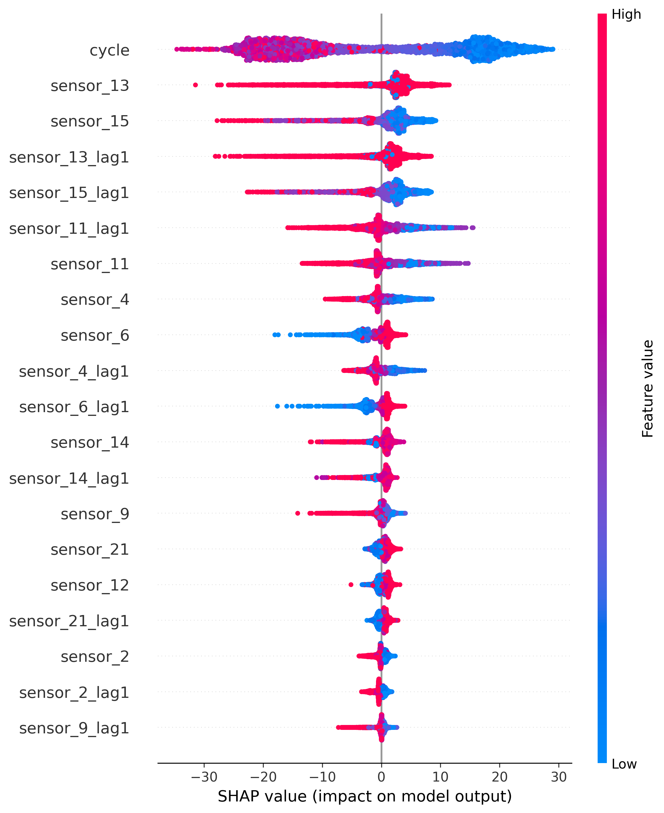
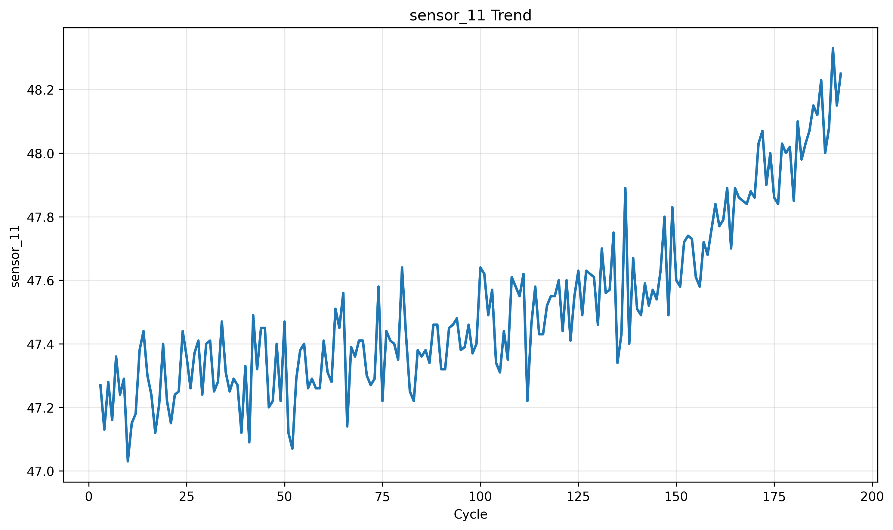
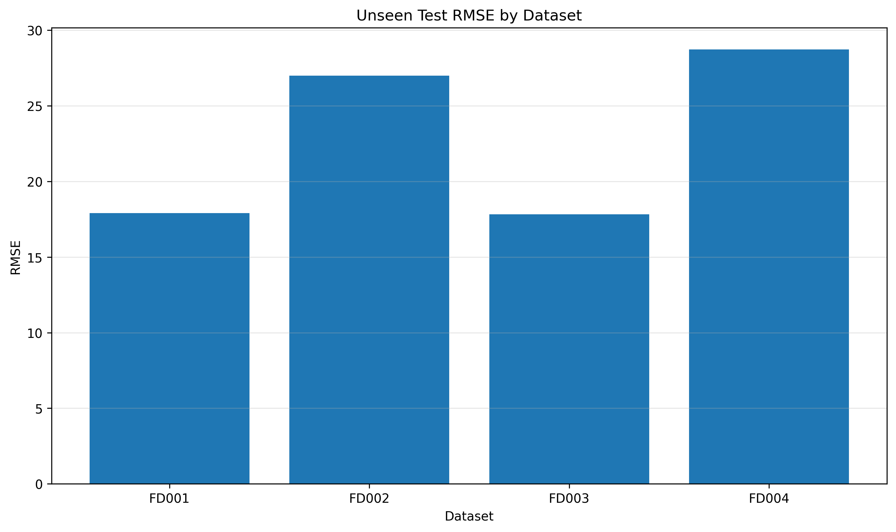

# Predictive Maintenance — Remaining Useful Life Prediction

An end-to-end machine learning project for predicting the **Remaining Useful Life (RUL)** of turbofan engines using NASA CMAPSS sensor data.

The project takes raw multivariate time-series sensor data through a complete ML workflow — from data ingestion and degradation-aware feature engineering to model training, hyperparameter optimization, explainability, unseen-test evaluation, and an interactive Streamlit dashboard.

> **Final Model:** Optimized XGBoost  
> **Evaluation:** NASA CMAPSS unseen test set  
> **Engines Evaluated:** 707  
> **Overall R²:** 0.752

---

## Why This Project?

Predictive maintenance aims to identify when equipment is approaching failure so maintenance can be planned before an unexpected breakdown.

Instead of predicting a simple failure/no-failure label, this project estimates:

**"How many operating cycles does this engine have left?"**

That makes the problem a practical **regression + time-series machine learning problem**.

---

## Project Highlights

- End-to-end ML pipeline built around the NASA CMAPSS dataset
- Remaining Useful Life calculation at engine level
- Time-series feature engineering using:
  - Sensor lag features
  - Rolling mean features
  - Operating-condition information
- Engine-wise validation to reduce data leakage
- Baseline model comparison
- XGBoost hyperparameter optimization with Optuna
- SHAP-based model explainability
- Evaluation on completely unseen NASA test engines
- Error analysis at dataset and engine level
- Interactive Streamlit dashboard for fleet and engine monitoring
- Configuration-driven project structure using `config.yaml`

---

## Model Performance

The final Optimized XGBoost model was evaluated on the **NASA CMAPSS unseen test set containing 707 engines**.

| Metric | Score |
|---|---:|
| **MAE** | **18.205 cycles** |
| **RMSE** | **25.433 cycles** |
| **R²** | **0.752** |

### Performance by CMAPSS Subset

| Dataset | Engines | MAE | RMSE | R² |
|---|---:|---:|---:|---:|
| FD001 | 100 | 13.504 | 17.898 | 0.815 |
| FD002 | 259 | 19.252 | 27.000 | 0.748 |
| FD003 | 100 | 13.262 | 17.819 | 0.815 |
| FD004 | 248 | 21.001 | 28.731 | 0.722 |
| **Overall** | **707** | **18.205** | **25.433** | **0.752** |

The subset-level results are reported separately because FD001–FD004 represent different operating conditions and fault scenarios.

---

## Dashboard

The project includes a Streamlit-based monitoring interface designed around three levels of analysis:

**Fleet → Engine → Dataset**

### Fleet Monitoring

The main dashboard provides an overview of the monitored engines, predicted RUL distribution, and engines requiring attention.


### Engine Explorer

The Engine Explorer allows an individual engine to be selected and inspected across its predicted RUL trajectory.


### Dataset Overview

The dataset view compares predicted RUL behaviour across the four CMAPSS subsets.


**[Live Dashboard →](YOUR_STREAMLIT_URL)**

---

## Machine Learning Workflow

```text
NASA CMAPSS Dataset
        │
        ▼
Data Ingestion
        │
        ▼
RUL Calculation
        │
        ▼
Data Cleaning
        │
        ▼
Feature Engineering
 ┌──────┼───────────────┐
 │      │               │
 ▼      ▼               ▼
Lag   Rolling Mean   Operating
      Features       Conditions
 └──────┼───────────────┘
        ▼
Engine-wise Validation
        │
        ▼
Model Benchmarking
        │
        ▼
XGBoost + Optuna
        │
        ▼
Optimized XGBoost
        │
        ├──────────────► SHAP Explainability
        │
        ▼
Unseen NASA Test Set
        │
        ▼
Evaluation + Error Analysis
        │
        ▼
Streamlit Dashboard
```

---

## Feature Engineering

Raw sensor readings alone do not fully describe how an engine is degrading over time.

To capture temporal behaviour, the pipeline creates:

### Lag Features

Previous-cycle sensor values are included to provide the model with short-term historical information.

Example:

```text
sensor_13
sensor_13_lag1
```

### Rolling Features

A rolling mean over the configured window is used to smooth short-term sensor noise and capture local trends.

Example:

```text
sensor_13_rolling_mean_3
```

The rolling window is controlled through `config.yaml`, keeping the feature engineering process configurable rather than hard-coded.

### Operating Conditions

The engine settings are used to create an operating-condition identifier so that sensor behaviour can be interpreted in its operating context.

---

## Model Explainability

Model performance alone does not explain **why** the model is making a prediction.

SHAP was used to examine how individual features influence the predicted RUL.



The analysis shows that features such as `cycle`, `sensor_13`, `sensor_13_lag1`, `sensor_15`, and their temporal variants have a substantial influence on the model output.

This provides a way to move from:

> "The model predicted this RUL."

to:

> "These features had the largest contribution to that prediction."

---

## Sensor Behaviour

The project also investigates sensor behaviour across engine lifetimes to understand degradation patterns before modelling.



---
## Error Analysis

After generating predictions on the unseen test set, prediction errors were analysed at the dataset level.

| Dataset | MAE | RMSE | Mean Residual | Maximum Error |
|---|---:|---:|---:|---:|
| FD001 | 13.504 | 17.898 | 1.001 | 43.715 |
| FD002 | 19.252 | 27.000 | 7.224 | 87.653 |
| FD003 | 13.262 | 17.819 | -2.418 | 60.907 |
| FD004 | 21.001 | 28.731 | 8.171 | 79.186 |

This analysis helps identify differences in model behaviour across operating environments and highlights cases where individual engine predictions deviate substantially from the ground-truth RUL.

---

## Generalization Across Operating Conditions

The model was not evaluated only on a single train/validation split.

The final pipeline uses the four NASA CMAPSS subsets:

- **FD001**
- **FD002**
- **FD003**
- **FD004**

Evaluating each subset independently provides a clearer picture of how the model behaves under different operating conditions and fault scenarios.



---

## Project Structure

```text
predictive_maintenance_RUL/
│
├── configs/
│   └── config.yaml
│
├── data/
│   ├── raw/
│   ├── interim/
│   ├── processed/
│   └── external/
│
├── dashboard/
│   └── app.py
│
├── models/
│   └── *.joblib
│
├── notebooks/
│
├── reports/
│   ├── figures/
│   ├── metrics/
│   └── model_parameters/
│
├── src/
│   ├── data/
│   ├── features/
│   ├── models/
│   ├── inference/
│   └── utils/
│
├── tests/
│
├── main.py
├── requirements.txt
├── Engineering_Decision.md
├── LICENSE
├── .gitignore
└── README.md
```

Generated datasets, trained model binaries, logs, and other local artifacts are intentionally excluded from version control where appropriate.

---

## Tech Stack

**Language**

- Python

**Data & ML**

- Pandas
- NumPy
- Scikit-learn
- XGBoost
- Optuna

**Explainability**

- SHAP

**Visualization**

- Matplotlib
- Plotly

**Application**

- Streamlit

**Model Persistence**

- Joblib

**Configuration & Project Utilities**

- YAML
- Git

---

## Running the Project

### 1. Clone the repository

```bash
git clone https://github.com/GauravPardeshi12/predictive-maintenance-rul.git
cd predictive_maintenance_RUL
```

### 2. Create a virtual environment

```bash
python -m venv .venv
```

Activate it on Windows:

```bash
.venv\Scripts\activate
```

### 3. Install dependencies

```bash
pip install -r requirements.txt
```

### 4. Add the NASA CMAPSS data

Place the required CMAPSS files inside:

```text
data/raw/
```

The training pipeline expects:

```text
train_FD001.txt
train_FD002.txt
train_FD003.txt
train_FD004.txt
```

The unseen-test evaluation uses the corresponding test files and NASA RUL ground-truth files.

### 5. Run the complete pipeline

```bash
python main.py
```

### 6. Launch the dashboard

```bash
streamlit run dashboard/app.py
```

---

## Configuration

Project settings are centralized in:

```text
configs/config.yaml
```

This controls paths, dataset settings, feature-engineering parameters, and model configuration.

For example:

```yaml
feature_engineering:
  rolling_window: 3

xgboost:
  n_estimators: 300
  learning_rate: 0.05
  max_depth: 6
```

Keeping these values in configuration makes the pipeline easier to reproduce and modify without changing the source code.

---

## What I Learned

This project helped me work through the complete machine learning lifecycle rather than stopping at model training.

Key areas covered:

- Time-series data preparation
- RUL formulation
- Feature engineering for degradation signals
- Engine-wise validation
- Regression model comparison
- Hyperparameter optimization
- Model persistence and inference
- SHAP explainability
- Unseen-test evaluation
- Error analysis
- Production-style project organization
- Streamlit deployment

---

## Limitations

The model is trained and evaluated on the NASA CMAPSS benchmark dataset. Therefore, its predictions should be interpreted as a research/project demonstration rather than a production maintenance system for real aircraft engines.

Real-world deployment would require domain-specific sensor calibration, failure definitions, operational constraints, monitoring, and validation against actual maintenance outcomes.

---

## Author

**Gaurav Pardeshi**

B.Tech — Artificial Intelligence & Data Science

Interested in **Data Science, Machine Learning, Predictive Analytics, and AI**.

---

## License

This project is available under the license included in the repository.