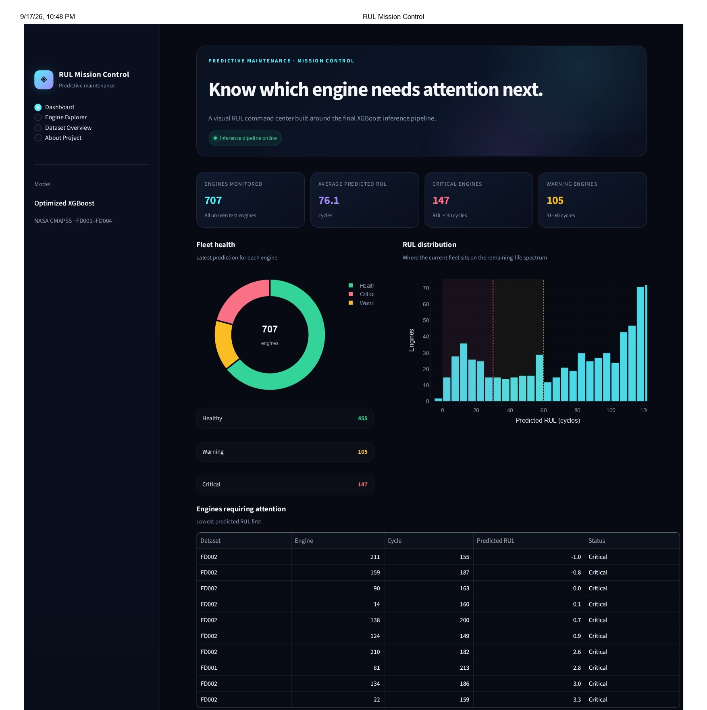
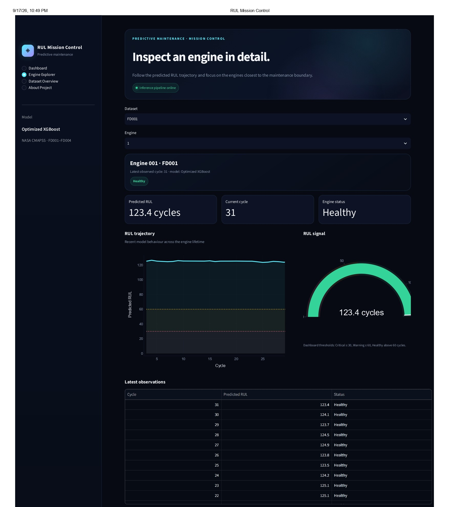
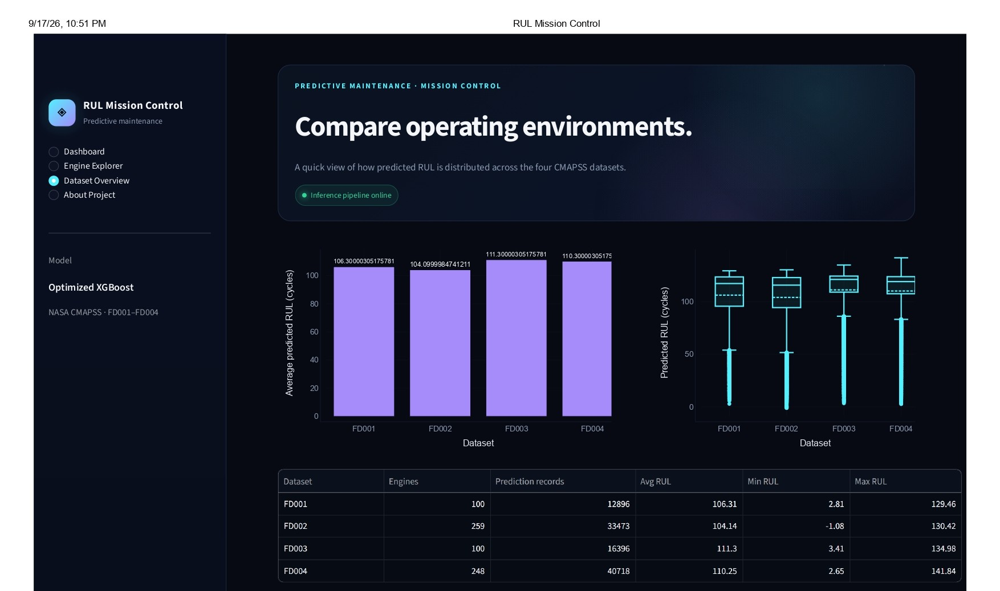

# Predictive Maintenance — Remaining Useful Life (RUL) Prediction

<p align="center">
  <strong>End-to-end machine learning pipeline for predicting the Remaining Useful Life of turbofan engines using NASA CMAPSS sensor data.</strong>
</p>

<p align="center">
  <a href="https://github.com/GauravPardeshi12/predictive-maintenance-rul">
    
  </a>
  
  
  
  
  
</p>

<p align="center">
  
  
  
  
  
</p>

---

## 📌 Project Overview

Predictive maintenance focuses on identifying equipment degradation early enough to support maintenance planning and reduce unexpected failures.

This project treats the problem as a **time-series regression task** and predicts:

> **How many operating cycles does an engine have left?**

The pipeline takes raw multivariate sensor data through data ingestion, RUL calculation, degradation-aware feature engineering, validation, model optimization, explainability, unseen-test evaluation, error analysis, and an interactive Streamlit dashboard.

### Results at a glance

| | Result |
|---|---:|
| **Final model** | Optimized XGBoost |
| **Evaluation data** | NASA CMAPSS unseen test set |
| **Engines evaluated** | 707 |
| **MAE** | **18.205 cycles** |
| **RMSE** | **25.433 cycles** |
| **R²** | **0.752** |

---

## 🚀 Key Highlights

- End-to-end ML workflow built around the **NASA CMAPSS** dataset
- Engine-level **Remaining Useful Life (RUL)** calculation
- Temporal feature engineering using:
  - Lag features
  - Rolling mean features
  - Operating-condition information
- **Engine-wise validation** to reduce data leakage
- Baseline model comparison
- **XGBoost hyperparameter optimization with Optuna**
- **SHAP-based model explainability**
- Evaluation on an **unseen NASA test set**
- Dataset-level and engine-level error analysis
- Interactive **Streamlit monitoring dashboard**
- Configuration-driven workflow using `config.yaml`
- Production-style project organization

---

## 📊 Model Performance

The final optimized XGBoost model was evaluated on the **NASA CMAPSS unseen test set containing 707 engines**.

| Metric | Score |
|---|---:|
| **MAE** | **18.205 cycles** |
| **RMSE** | **25.433 cycles** |
| **R²** | **0.752** |

### Performance by CMAPSS Subset

| Dataset | Engines | MAE | RMSE | R² |
|---|---:|---:|---:|---:|
| FD001 | 100 | 13.504 | 17.898 | 0.815 |
| FD002 | 259 | 19.252 | 27.000 | 0.748 |
| FD003 | 100 | 13.262 | 17.819 | 0.815 |
| FD004 | 248 | 21.001 | 28.731 | 0.722 |
| **Overall** | **707** | **18.205** | **25.433** | **0.752** |

FD001–FD004 are reported separately because they represent different operating conditions and fault scenarios.

---

## 🖥️ Dashboard

The project includes a Streamlit monitoring interface organized around three levels of analysis:

**Fleet → Engine → Dataset**

### Fleet Monitoring

Provides an overview of monitored engines, predicted RUL distribution, and engines requiring attention.



### Engine Explorer

Allows an individual engine to be selected and inspected across its predicted RUL trajectory.



### Dataset Overview

Compares predicted RUL behaviour across the four CMAPSS subsets.



**[Live Dashboard →](https://predictive-maintenance-rul-nasa-cmapss.streamlit.app/)**

> Replace `YOUR_STREAMLIT_URL` with the deployed Streamlit application URL.

---

## 🔄 Machine Learning Workflow

```text
NASA CMAPSS Dataset
        │
        ▼
   Data Ingestion
        │
        ▼
    RUL Calculation
        │
        ▼
    Data Cleaning
        │
        ▼
 Feature Engineering
   ┌────┼───────────────┐
   │    │               │
   ▼    ▼               ▼
 Lag  Rolling Mean   Operating
Features  Features   Conditions
   └────┼───────────────┘
        │
        ▼
Engine-wise Validation
        │
        ▼
 Model Benchmarking
        │
        ▼
 XGBoost + Optuna
        │
        ▼
Optimized XGBoost
   │            │
   │            └──────► SHAP Explainability
   ▼
Unseen NASA Test Set
        │
        ▼
Evaluation + Error Analysis
        │
        ▼
 Streamlit Dashboard
```

---

## 🧩 Feature Engineering

Raw sensor readings do not fully describe how an engine is degrading over time. The pipeline therefore adds temporal features that provide short-term historical context.

### Lag Features

Previous-cycle sensor values are included to capture short-term changes.

Example:

```text
sensor_13
sensor_13_lag1
```

### Rolling Features

A rolling mean is used to smooth short-term sensor noise and capture local trends.

Example:

```text
sensor_13_rolling_mean_3
```

The rolling window is controlled through `config.yaml`, keeping feature engineering configurable rather than hard-coded.

### Operating Conditions

Engine settings are used to create an operating-condition identifier so that sensor behaviour can be interpreted within its operating context.

---

## 🔍 Model Explainability

Model performance alone does not explain **why** a prediction was made.

SHAP is used to examine how individual features influence predicted RUL.


The analysis identifies features such as `cycle`, `sensor_13`, `sensor_13_lag1`, `sensor_15`, and their temporal variants as important contributors to model output.

This makes the model analysis more interpretable:

> **Prediction:** What RUL did the model estimate?

> **Explanation:** Which features contributed to that estimate?

---

## 📈 Sensor Behaviour

The project also investigates sensor behaviour across engine lifetimes to understand degradation patterns before modelling.


---

## ⚠️ Error Analysis

Prediction errors were analysed at the dataset level after inference on the unseen test set.

| Dataset | MAE | RMSE | Mean Residual | Maximum Error |
|---|---:|---:|---:|---:|
| FD001 | 13.504 | 17.898 | 1.001 | 43.715 |
| FD002 | 19.252 | 27.000 | 7.224 | 87.653 |
| FD003 | 13.262 | 17.819 | -2.418 | 60.907 |
| FD004 | 21.001 | 28.731 | 8.171 | 79.186 |

This analysis helps identify differences in model behaviour across operating environments and highlights cases where individual engine predictions deviate substantially from ground-truth RUL.

---

## 🌐 Generalization Across Operating Conditions

The final pipeline uses all four NASA CMAPSS subsets:

- **FD001**
- **FD002**
- **FD003**
- **FD004**

Evaluating the subsets independently provides a clearer view of model behaviour across different operating conditions and fault scenarios.


---

## 📁 Project Structure

```text
predictive_maintenance_RUL/
│
├── configs/
│   └── config.yaml
│
├── data/
│   ├── raw/
│   ├── interim/
│   ├── processed/
│   └── external/
│
├── dashboard/
│   └── app.py
│
├── models/
│   └── *.joblib
│
├── notebooks/
│
├── reports/
│   ├── figures/
│   ├── metrics/
│   └── model_parameters/
│
├── src/
│   ├── data/
│   ├── features/
│   ├── models/
│   ├── inference/
│   └── utils/
│
├── tests/
│
├── main.py
├── requirements.txt
├── Engineering_Decision.md
├── LICENSE
├── .gitignore
└── README.md
```

Generated datasets, trained model binaries, logs, and other local artifacts are intentionally excluded from version control where appropriate.

---

## 🛠️ Tech Stack

| Category | Tools |
|---|---|
| **Language** | Python |
| **Data Processing** | Pandas, NumPy |
| **Machine Learning** | Scikit-learn, XGBoost |
| **Optimization** | Optuna |
| **Explainability** | SHAP |
| **Visualization** | Matplotlib, Plotly |
| **Application** | Streamlit |
| **Model Persistence** | Joblib |
| **Configuration** | YAML |
| **Version Control** | Git |

---

## ▶️ Getting Started

### 1. Clone the repository

```bash
git clone https://github.com/GauravPardeshi12/predictive-maintenance-rul.git
cd predictive_maintenance_RUL
```

### 2. Create a virtual environment

```bash
python -m venv .venv
```

Activate it on Windows:

```bash
.venv\Scripts\activate
```

### 3. Install dependencies

```bash
pip install -r requirements.txt
```

### 4. Add NASA CMAPSS data

Place the required CMAPSS files inside:

```text
data/raw/
```

The training pipeline expects:

```text
train_FD001.txt
train_FD002.txt
train_FD003.txt
train_FD004.txt
```

The unseen-test evaluation uses the corresponding test files and NASA RUL ground-truth files.

### 5. Run the complete pipeline

```bash
python main.py
```

### 6. Launch the dashboard

```bash
streamlit run dashboard/app.py
```

---

## ⚙️ Configuration

Project settings are centralized in:

```text
configs/config.yaml
```

The configuration controls paths, dataset settings, feature-engineering parameters, and model configuration.

Example:

```yaml
feature_engineering:
  rolling_window: 3

xgboost:
  n_estimators: 300
  learning_rate: 0.05
  max_depth: 6
```

Keeping these values in configuration makes the pipeline easier to reproduce and modify without changing source code.

---

## 🎯 What This Project Demonstrates

This project covers the complete machine learning lifecycle rather than stopping at model training:

- Time-series data preparation
- RUL formulation
- Degradation-oriented feature engineering
- Engine-wise validation
- Regression model comparison
- Hyperparameter optimization
- Model persistence and inference
- SHAP explainability
- Unseen-test evaluation
- Error analysis
- Production-style project organization
- Streamlit deployment

---

## ⚠️ Limitations

The model is trained and evaluated on the **NASA CMAPSS benchmark dataset**. Its predictions should therefore be interpreted as a research/project demonstration rather than as a production maintenance system for real aircraft engines.

Real-world deployment would require domain-specific sensor calibration, failure definitions, operational constraints, continuous monitoring, and validation against actual maintenance outcomes.

---

## 👤 Author

**Gaurav Pardeshi**

B.Tech — Artificial Intelligence & Data Science

Interested in **Data Science, Machine Learning, Predictive Analytics, and AI**.

---

## 📄 License

This project is available under the license included in the repository.
